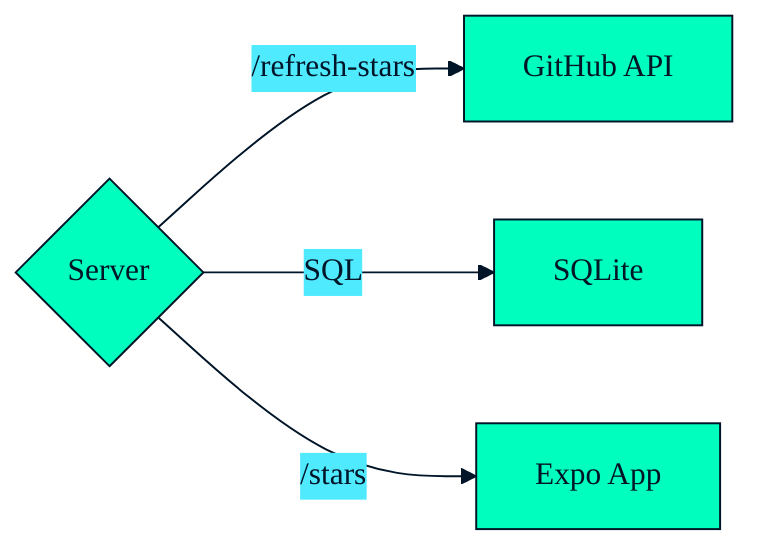

---
layout: centered
background: ./02.png
---

---
layout: centered
background: ./03.png
---

---
layout: cover
---

# Table of Contents

<v-clicks style="zoom: 150%">

1. **What is Effect 🤔**
2. **Basics 🎒**
3. **Live Coding 🧑‍💻**
4. **Closing Thoughts 💡**

</v-clicks>

---
layout: centered
---

# 1️⃣ What is Effect 🤔

---

# What is Effect 🤔

<v-clicks depth="2">

- TypeScript library
- useful primitives:
  - 🧰 functional programming data primitives: `Option`, `Either`, `Chunk`, `Ref`, `Array`, `Record`, `Order`, `SortedMap`, `SortedSet`, `Queue`, ...
  - 🛟 type safe error handling
  - 🧑‍🔬 concurrency, fibers, observability, scheduling, interruptibility
  - 🥳 "dependency injection"
- helps build apps that are:
  - ✅ reliable
  - ✅ reusable
  - ✅ testable
  - ✅ maintainable
  - ✅ scalable

</v-clicks>

---
layout: image
image: mind.jpg
backgroundSize: contain
---

---
layout: centered
---

# 2️⃣ Effect Basics 🎒 

---

# 🎒 Basics: Effect Type

<v-click>

`Effect<ASuccess, Error, Requirements>`

</v-click>

<v-click>

... **immutable** representation of **lazy** program

</v-click>

<v-clicks depth="4">

- `ASuccess`: "returned" value
- `Error`: expected error(s)
- `Requirements`: contextual requirement(s)

</v-clicks>

---
layout: two-columns
---

::top::

# 🎒 Basics: Creating Effect

::left::

<v-click at="1">

`Effect<ASuccess, Error, Requirements>`

</v-click>
<v-click at="2">

```ts twoslash
import { Effect } from 'effect';

const success: Effect.Effect<number>
  = Effect.succeed(42);
```

</v-click>
<v-click at="5">

```ts twoslash
import { Effect } from 'effect';
// ---cut---
const failure = Effect.fail('Error');
```

</v-click>
<v-click at="7">

```ts twoslash
import { Effect } from 'effect';
// ---cut---
const parse = (data: string) => Effect.try(
  () => JSON.parse(data)
);
```

</v-click>

::right::

<v-click at="3">

😝 ~~ `Promise<ASuccess>`

</v-click>
<v-click at="4">

```ts twoslash


const success = Promise.resolve(42);
```

</v-click>
<v-click at="6">

```ts twoslash

const failure = Promise.reject('Error');
```

</v-click>
<v-click at="8">

```ts twoslash
const parse = (data: string) => new Promise<any>(
  (resolve) => resolve(JSON.parse(data))
);
```

</v-click>

---
layout: two-columns
---

::top::

# 🎒 Basics: 🏃 Running ➡️ Sync Effect

::left::

`Effect`

```ts {1-5|1-7|all} twoslash
import { Effect } from "effect";

const parse = (data: string) => Effect.try(
  () => JSON.parse(data)
);

const program = parse('{"hello": "world"}');

console.log(Effect.runSync(program));
```

::right::

<v-click>

😝 ~~ `React`


```tsx {1-5|1-7|all} twoslash
import * as React from 'react';
// ---cut---
import { createRoot } from 'react-dom/client';

const App = ({ data }: { data: string}) => (
  <div>Hello, {data}!</div>
);

const program = <App data="World" />;

const root = createRoot(
  document.getElementById('root')!
);
root.render(program);
```

</v-click>

---

# 🎒 Basics: 🏃 Running 🕰️ Async Effect

```ts {1-9|1-11|1-13|all} twoslash
import { Effect } from "effect";

const delay = (millis: number) =>
  Effect.tryPromise(
    () =>
      new Promise<string>((resolve) => {
        setTimeout(() => resolve("Done"), millis);
      }),
  );

const program = delay(200);

Effect.runSync(program) // 👎 throws an error
console.log(await Effect.runPromise(program)); // 👍
```

---
layout: two-columns
---

::top::

# 🎒 Basics: 🪈 `pipe`

::left::

```ts {1|all} twoslash
import { pipe } from 'effect';

const result = pipe(
  1,
  a => a + 2, // 1 + 2 = 3
  b => b * 3, // 3 * 3 = 9
  c => { console.log(c); return c; },
  d => `result: ${d}`, // result: 9
);
```

::right::

<v-click>

```ts {1-3|1-4|1-5|1-6|1-7|1-9|all} twoslash
import { Effect, pipe } from 'effect';

const program = pipe(
  Effect.succeed(1),
  Effect.map(a => a + 2),
  Effect.flatMap(b => Effect.succeed(b * 3)),
  Effect.tap(c => Effect.log(c)),
  Effect.map(d => `result: ${d}`),
);

const result = await Effect.runPromise(program);
```

</v-click>

---
layout: centered
background: ./theme/bgs/wawy3.png
---

# 🎒 Basics: Mini Demo 01

https://github.com/heracek/github-stars-effect

`pnpm basics01`

---
layout: two-columns
---

::top::

# 🎒 Basics<v-click at="2">: 🧬 `Effect.gen`</v-click>

::left::

😝 ~~ `Promise`

<v-click>

```ts
import sleep from 'sleep-promise';


const asyncRandom = async (delay: number) => {
  const data = await fetchRandomInt(
    0,
    100
  );

  await sleep(delay)

  return data
};
```

</v-click>

::right::

<v-click at="3">

`Effect`

```ts twoslash
import { Effect, Random } from 'effect';

const asyncRandom = (delay: number) =>
  Effect.gen(function* () {
    const data = yield* Random.nextIntBetween(
      0,
      100
    );

    yield* Effect.sleep(delay);

    return data;
  });
```

</v-click>

---
layout: two-columns
---

::top::

# 🎒 Basics<v-click at="2">: 🏎️ `Effect.all`</v-click>

::left::

😝 ~~ `Promise.all`

<v-click>

```ts twoslash

const asyncRandom = async (delay: number) => {
// ---cut-start---
  return 1
// ---cut-end---
  // ...
};


const data = Promise.all([
  asyncRandom(2000),
  asyncRandom(2000),
  asyncRandom(2000),
  asyncRandom(2000),
  asyncRandom(2000),
]);
```

</v-click>

<v-click at="4">

👎 `Promise`: eager execution

</v-click>

::right::

<v-click at="3">

`Effect.all`

```ts twoslash
import { Effect, Random } from 'effect';

// ---cut---
const asyncRandom = (delay: number) =>
  Effect.gen(function* () {
// ---cut-start---
    const data = yield* Random.nextIntBetween(
      0,
      100
    );

    yield* Effect.sleep(delay);

    return data;
// ---cut-end---
    // ...
  });


const data = Effect.all([
  asyncRandom(2000),
  asyncRandom(2000),
  asyncRandom(2000),
  asyncRandom(2000),
  asyncRandom(2000),
], { concurrency: 'unbounded' });
```

</v-click>

<v-click at="5">

👍 `Effect`: lazy execution

</v-click>

<v-click at="6">

```ts
Effect.all([...], { concurrency: 3 });
```

</v-click>

---
layout: centered
background: ./theme/bgs/wawy3.png
---

# 🎒 Basics: Mini Demo 02

https://github.com/heracek/github-stars-effect

`pnpm basics02`

---

# 📚 Effect Docs

<v-clicks>

- 🤩 [effect.website/docs](https://effect.website/docs/introduction)
- 🧑‍🔬 [github.com/Effect-TS/effect/tree/main/packages](https://github.com/Effect-TS/effect/tree/main/packages)
  - [github.com/Effect-TS/effect/tree/main/packages/schema#readme](https://github.com/Effect-TS/effect/tree/main/packages/schema#readme)
  - [github.com/Effect-TS/effect/tree/main/packages/platform#readme](https://github.com/Effect-TS/effect/tree/main/packages/platform#readme)
- 📺 [youtube.com/@effect-ts](https://www.youtube.com/@effect-ts)
  - Effect Days 2024 conference videos
  - Effect Days 2024: Beginner / Intermediate Workshop: [youtu.be/Lz2J1NBnHK4](https://youtu.be/Lz2J1NBnHK4)

</v-clicks>

---
layout: centered
---

# 3️⃣ Live Coding 🧑‍💻

---
layout: center
---

# 🧑‍💻 Live Coding: GitHub Stars App

<div class="grid grid-cols-1">



</div>

---
layout: centered
---

# Questions?

---
layout: thank-you
---

---
layout: centered
background: ./91.png
---

---
layout: centered
background: ./92.jpg
---

---

# Concurrency

- Drake meme
  - Threads vs Fibers
  - Parallel  vs Concurrent
https://commons.wikimedia.org/wiki/File:Parallel-concurrent.png
https://msl-network.readthedocs.io/en/stable/concurrency_async.html

---

# 1) Effect ~== React for Logic

Can I just mix multiple libraries to get functionality similar to Effect?

Maybe...

With Effect it's easy to mix things. Also it is easy to wrap things to Effect.

Similar to React. Almost any React library will work in any React app...

React Components are very composable.

Effects are very Composable too.

```tsx
const SomeComponent: React.Component<{ name: string }> = ({ name }) => (
  <div>Hello, {name}</div>
);

const DifferentComponent: React.Component = () => <div>Yada, yada.</div>;

const FinalComponent: React.Component<{ name: string }> = ({ name }) => (
  <>
    <SomeComponent name={name} />
    <DifferentComponent />
  </>
);
```

```ts
// (name: string) => Effect<never, never, string>
const someEffect = (name: string) => Effect.succeed(`Hello, ${name}`);

// () => Effect<never, never, string>
const differentEffect = () => Effect.succeed(`Yada, yada.`);

// (name: string) => Effect<never, never, [string, string]>
const finalEffect = (name: string) =>
  Effect.zip(someEffect(name), differentEffect);

// (name: string) => Effect<never, never, string>
const finalEffectString = (name: string) =>
  Effect.zip(someEffect(name), differentEffect).pipe(
    Effect.map((twoStrings) => twoStrings.join('\n')),
  );
```

---

# Effect vs Promises

- no errors
- no requirements (Context)

```ts
Effect.all([...])

Promise.all([...])
```

---

# 2) Effect ~== React for Logic

https://effect.website/docs/essentials/running#cheatsheet

```tsx
import { createRoot } from 'react-dom/client';

const App = () => <div>Hello, World!</div>;

const root = createRoot(document.getElementById('root'));
root.render(<App />);

// --- //

import { Effect } from 'effect';

const app = Effect.log('Hello, World!');

Effect.runPromise(app);
```

---

## 1) `Effect.gen` vs. `async`/`await`

```ts
const task1 = Promise.resolve(10);

export const program = async function () {
  const a = await task1;
  return `Result is: ${a}`;
};

// --- //

const task1 = Effect.promise(() => Promise.resolve(10));

export const program = Effect.gen(function* (_) {
  const a = yield* _(task1);
  return `Result is: ${a}`;
});
```

## 2) `Effect.gen` vs. `async`/`await`

https://effect.website/docs/essentials/using-generators#comparing-effectgen-with-asyncawait

---

**thunk** = function that takes no arguments and returns some value ([source](https://effect.website/docs/guides/essentials/creating-effects))

---

## Constructors

- `Effect.succeed` - successful Effect with specific value, not lazy
- `Effect.fail` - failing Effect with specific error, not lazy
- `Effect.sync` - synchronous side effect, never throws an error, lazy
- `Effect.try` - synchronous, may throw error (by default `UnknownException`, but can be mapped), lazy
- `Effect.promise` - async, `Promise` that never rejects, lazy
- `Effect.tryPromise` - async, `Promise` that may reject (by default `UnknownException`, but can be mapped), lazy
- `Effect.async` - async, code for "callback" style wrapping (e.g. Node.js `"fs"` library)
- `Effect.suspend` [source](https://effect.website/docs/guides/essentials/creating-effects#suspended-effects) - **thunk** that delays creation of the effect
  - useful for **lazy evaluation**, **handling circular dependencies**, **unifying return type**

also see [Cheatsheet](https://effect.website/docs/guides/essentials/creating-effects#cheatsheet)

---

## Effect vs Promise

### `Promise<Value>` vs `Effect<Value, Error, Requirements>`

- expressive error handling
- definition of requirements
- `Promise` -> `Effect`:
  - `Effect.promise`
  - `Effect.tryPromise`

---

## Running Effect

- `runSync` - run synchronously and immediately return the result
  - execution will throw runtime error at first async effect is provided
- `runSyncExit` - same as `runSync` but return `Exit` value containing result of execution (`Exit.Success<Value>`/`Exit.Failure<Error>`)
- `runPromise` - runs asynchronous Effect and "return" value as `Promise`
  - it will reject the `Promise` if Effect fails
- `runPromiseExit` - run async Effect and "return" result as `Promise` that resolves to `Exit`
  - (i think) the `Promise` will never reject

see [Cheatsheet](https://effect.website/docs/guides/essentials/running-effects#cheatsheet)

---

## Generators

- similar to `async`/`await`
- optional part of Effect

```ts
const task = Effect.promise(() => Promise.resolve(42));

export const program = Effect.gen(function* (_) {
  const value = yield* _(task);
  return `Result is: ${value}`;
});
```

- ✅ `_` is `pipe` too!

```ts
import { Effect, Random } from 'effect';

const program = Effect.gen(function* (_) {
  const n = yield* _(
    Random.next,
    Effect.map((n) => n * 2),
  );
  return n;
});
```

---

## Advanced - `Effect.gen` in a class

```ts
import { Effect } from 'effect';

class MyService {
  readonly local = 1;
  compute() {
    // ...............  v--- sets `this` for generator
    return Effect.gen(this, function* (_) {
      return yield* _(Effect.succeed(this.local + 1));
    });
  }
}
```

---

## Pipelines

- railway oriented programmig
- Advantages
  - readability
  - code organization
  - reusability
  - type safety

---

### `pipe`

- functions passed to `pipe` must take only one argument

```ts
import { pipe } from 'effect';

const increment = (x: number) => x + 1;
const double = (x: number) => x * 2;
const subtractTen = (x: number) => x - 10;

const result = pipe(5, increment, double, subtractTen);

console.log(result); // Output: 2
```

---

Effect uses functions.

```ts
import { pipe, ReadonlyArray } from 'effect';

console.log(
  // methods and chaining
  [1, 2, 3]
    .map((i) => i + 1) //
    .map((i) => `${i}`),
);

console.log(
  // pipe and functions
  pipe(
    [1, 2, 3],
    ReadonlyArray.map((i) => i + 1),
    ReadonlyArray.map((i) => `${i}`),
  ),
);
```

- ✅ tree-shakeblity
- ✅ extensibility
- there is and exception of `pipe`: `Effect.succeed(1).pipe(...)`

---

### `Effect.map`

```ts
import { pipe, Effect } from 'effect';

const mappedEffect = pipe(
  Effect.succeed(5),
  Effect.map((x) => x + 1),
);

Effect.runPromise(mappedEffect).then(console.log); // Output: 6
```

---

### `Effect.flatMap`

Similar to `Effect.map`, but works with functions that return `Effect`.

```ts
import { pipe, Effect } from 'effect';

const divide = (a: number, b: number): Effect.Effect<number, Error> =>
  b === 0
    ? Effect.fail(new Error('Cannot divide by zero'))
    : Effect.succeed(a / b);

const flatMappedEffect = pipe(
  Effect.succeed([10, 2]),
  Effect.flatMap(([a, b]) => divide(a, b)),
);

Effect.runPromise(flatMappedEffect).then(console.log); // Output: 5
```

---

## `Effect.tap`

- similar to `Effect.flatMap`
- executes side-effect without altering result

```ts
import { pipe, Effect } from 'effect';

const program = pipe(
  Effect.succeed([10, 2]),
  Effect.tap(([a, b]) =>
    Effect.sync(() => console.log(`Performing division: ${a} / ${b}`)),
  ),
  // [a, b] is still available!
  Effect.flatMap(([a, b]) => divide(a, b)),
);
```

```ts
import { pipe, Console, Effect } from 'effect';

const program = pipe(
  Effect.succeed([10, 2]),
  Effect.tap(([a, b]) => Console.log([a, b])),
  // [a, b] is still available!
  Effect.flatMap(([a, b]) => divide(a, b)),
);
```

---

## `Effect.all`

- combines effects provided in tuple/Array
- ❗ unlike `Promise.all`: `Effect.all` runs effect in sequence as provided

```ts
import { pipe, Console, Effect } from 'effect';

const program = pipe(
  Effect.all([
    Effect.succeed(42), //
    Effect.succeed('Hello'),
  ]),
  Effect.tap(Console.log), // Output: [42, "Hello"]
);
```

- by default short-circuiting: on first error it will stop executing and return **first error**
- `Effect.all` works with:
  - tuples, Iterables, structs, Records
  - ([source](https://effect.website/docs/guides/control-flow#all))

---

## `Effect.all` mode `"either"`

```ts
import { Effect, Console } from 'effect';

const program = [
  [
    Effect.succeed('Task1').pipe(Effect.tap(Console.log)),
    Effect.fail('Task2: Oh no!').pipe(Effect.tap(Console.log)),
    Effect.succeed('Task3').pipe(Effect.tap(Console.log)),
  ],
  Effect.all({ mode: 'either' }),
];
```

- return tuple of `Either`s types
  - `Either.right` is "success" with value
  - `Either.left` is "failure" with error

---

## `Effect.all` mode `"validate"`

- return tuple of values
- if some input Effect fails the error is tuple of `Options`
  - `Option.some` is "success" with value
  - `Option.none` is "failure" (without error)

---

# Error Handling

- **Expected Errors**: anticipated errors handled by type system
  - `Effect<string, HttpError>`
- **Unexpected Errors**: unexpected and not part of intuited program flow
  - sometimes called "defects", "untyped errors", "unrecoverable errors"
  - not tracked in Effect type

---

## Expected Error

```ts
import { Effect } from 'effect';

class HttpError {
  readonly _tag = 'HttpError';
}

const program = Effect.fail(new HttpError());
```

- class used to get concise syntax for:
  - type `HttpError`
  - constructor `new HttpError()`
  - e.g.: `const error: HttpError = new HttpError()`
- but anything could represent error in Effect
- `_tag` is used as **discriminant field**
  - helpful to distinguish between errors
  - also prevents TypeScript unification of types

---

### Error Tracking

```ts
import { Effect, Random } from 'effect';

class FooError {
  readonly _tag = 'FooError';
}

class BarError {
  readonly _tag = 'BarError';
}

// Effect<string, FooError | BarError>
const program = Effect.gen(function* (_) {
  const rand = yield* _(Random.next);

  if (rand < 0.33333333) return 'yay!';

  return rand > 0.6666666
    ? yield* _(Effect.fail(new FooError()))
    : yield* _(Effect.fail(new BarError()));
});
```

---

## Catching Errors

### `Effect.either`

```ts
Effect<A, E, R> -> Effect<Either<E, A>, never, R>
```

- use `Either.match`
- if all errors use `readonly _tag` filed
  - you can use `Effect.catchTag`:
  ```ts
  const recovered = spipe(
    Effect.catchTag('FooError', (_fooError) =>
      Effect.succeed('Recovering from FooError'),
    ),
  );
  ```
- or `Effect.catchTags` to catch multiple tags:
  ```ts
  const recovered = program.pipe(
    Effect.catchTags({
      FooError: (_fooError) => Effect.succeed(`Recovering from FooError`),
      BarError: (_barError) => Effect.succeed(`Recovering from BarError`),
    }),
  );
  ```

---

## Unrecoverable Errors

- `Effect.die` - any error
- `Effect.dieMessage` - `RuntimeException` with specific message
- `Effect.orDie` - move all recoverable errors to unrecoverable (when I don't wish to handle errors)
- `Effect.orDieWith` - allows to map errors

---

### Catching Unrecoverable Errors

- usually app should crash when there is a defect
- in some cases (like application plugins) it may be useful to catch defects and not crash the app
- `Effect.catchAllDefects`
  - handles only **defects**, not expected errors
- `Effect.catchSomeDefect`
  - recover from some errors
  - return `Option.some(Effect)` for caught error,
  - or `Option.none()` for uncaugth

---

## Fallback

- `Effect.orElse`: try one effect, if fails try another one
- `Effect.orElseSucceed` - replaces value if one fails
- `Effect.orElseFail` - replaces error if one fails (ignoring original error(s))
- `Effect.firstSuccessOf`
  - returns first successful value, or last error

---

## Matching

- `Effect.match` - handle both cases, return new success
- `Effect.ignore` - ignore both success and failure
- `Effect.matchEffect` - handle both, return new Effects
- `Effect.matchCause` / `Effect.matchCauseEffect` - access to full cause

---

...

---

- `Effect.filterOrFail` as type-guard

```ts
Effect.filterOrFail(
  // Define a guard to narrow down the type
  (user): user is User => user !== null,
  () => new Error('Unauthorized'),
);
```

- you may use `Predicate.isNotNull`

---

# Services

```ts
export class ServiceRandom extends Context.Tag('ServiceRandom')<
  ServiceRandom,
  { readonly next: Effect.Effect<number> }
>() {}
```

---

### Advanced - `Effect.as`

- replaces Effect with new provided in argument

```ts
import { pipe, Effect } from 'effect';

const program = pipe(
  Effect.succeed(5), //
  Effect.as('new value'),
);

Effect.runPromise(program).then(console.log); // Output: "new value"
```

---

## Dual (API)

A lot of Effect functions support dual API: "data-first" and "data-last"

```ts {all|5|7|7-8|10|all} twoslash
import { pipe, Effect } from 'effect';

// Data first
Effect.map(Effect.succeed(1), (n) => n + 1);

// Data last

pipe(
  Effect.succeed(1),
  Effect.map((n) => n + 1),
);

// or

Effect.succeed(1).pipe(Effect.map((n) => n + 1));
```

---

- I don't know a thing about Effect.
- Is there alternatives?
  - nothing
    - ~= mess?
  - other FP
    - fp-ts/io-ts ... dead
    - [morphic-ts](https://github.com/sledorze/morphic-ts)
    - Zod, valibot, ...
    - ramda, lodash, ...
    - axios
    - RxJS
  - other languages
    - Scala + ZIO
    - Rust?
- What are bad sides? What you don't like?
- Is it usable for back-end development?
- Branded types
- Error handling (process errors from API response)
- Is it suitable for event-based projects?
  - ???
- How does it compare to reactive programming libs such as RxJS?
- 4. Do you use it in commercial projects? How it goes?
- 5. How did you sell it to team members and managers?
- 6. Did you see any challenges which slows you (a team) down?

---

# END

---
layout: default
---

- There are the following layouts prepared for Ciklum presentations:
  - centered
  - default (same as if you don't define any)
  - iframe
  - image-bottom-right
  - image-right (top right)
  - intro (section for name and date included)
  - thank you
  - two columns (can have also full-width section above `::top::` and below `::bottom::` the columns)
- Any custom Ciklum slide can have a background
  - If you want to add our own background image use it as `background: ./test.png` and add the image into the `public` root folder

---
layout: centered
background: ./theme/bgs/wawy3.png
---

# Section title

---
layout: centered
background: ./theme/bgs/wawy2.png
---

# Section title

## With subtitle

And some text about something

---
layout: image-right
image: test.png
---

# Image right

asdasd asd sdf sdafgf sdf sdf sdf sdf asdasd asd sdf sdafgf sdf sdf sdf sdf asdasd asd sdf sdafgf sdf sdf sdf sdf asdasd asd sdf sdafgf sdf sdf sdf sdf asdasd asd sdf sdafgf sdf sdf sdf sdf asdasd asd sdf sdafgf sdf sdf sdf sdf <a href="https://github.com/">Link</a>

---
layout: image-bottom-right
image: test.png
---

# Image bottom right

asdasd asd sdf sdafgf sdf sdf sdf sdf asdasd asd sdf sdafgf sdf sdf sdf sdf asdasd asd sdf sdafgf sdf sdf sdf sdf asdasd asd sdf sdafgf sdf sdf sdf sdf asdasd asd sdf sdafgf sdf sdf sdf sdf asdasd asd sdf sdafgf sdf sdf sdf sdf

---

# Default slide 

## You don't need to specify a layout here


* &lt;funny meme goes here&gt;
* &lt;funny meme goes here&gt;
* &lt;funny meme goes here&gt;
* &lt;funny meme goes here&gt;

---
layout: two-columns
---

::top::
# Two columns layout

::left::
All content after `::left::` ends up on the left

Code here

```ts
<div *ngIf="number === 0; else checkNumbers">
  Cannot divide by {{ number }}
</div>

<ng-template #checkNumbers>
  <div *ngIf="isOdd(number); else isEven">
    Divisor {{ number }} is odd
  </div>
</ng-template>

<ng-template #isEven>
  <div>
  Divisor {{ number }} is even
  </div>
</ng-template>
```

::right::
All content after `::right::` ends up on the left

- Some other content here
- Some other content here
- Some other content here
- Some other content here

---
layout: centered
background: '#f3f3f3'
---

<div class="mb-3">Standalone Image</div>


---
withLogo: false
background: '#f3f3f3'
---

<excalidraw-svg src="drawings/example.excalidraw" :fullscreen="true" />
