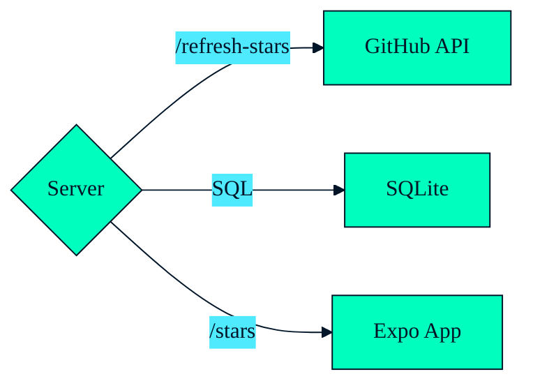

---
layout: centered
background: ./02.png
---

---
layout: centered
background: ./03.png
---

---
layout: cover
---

# Table of Contents

<v-clicks style="zoom: 150%">

1. **What is Effect 🤔**
2. **Basics 🎒**
3. **Live Coding 🧑‍💻**
4. **Closing Thoughts 💡**

</v-clicks>

---
layout: centered
---

# 1️⃣ What is Effect 🤔

---

# What is Effect 🤔

<v-clicks depth="2">

- TypeScript library
- useful primitives:
  - 🧰 functional programming data primitives: `Option`, `Either`, `Chunk`, `Ref`, `Array`, `Record`, `Order`, `SortedMap`, `SortedSet`, `Queue`, ...
  - 🛟 type safe error handling
  - 🧑‍🔬 concurrency, fibers, observability, scheduling, interruptibility
  - 🥳 "dependency injection"
- helps build apps that are:
  - ✅ reliable
  - ✅ reusable
  - ✅ testable
  - ✅ maintainable
  - ✅ scalable

</v-clicks>

---
layout: image
image: mind.jpg
backgroundSize: contain
---

---
layout: centered
---

# 2️⃣ Effect Basics 🎒 

---

# 🎒 Basics: Effect Type

<v-click>

`Effect<ASuccess, Error, Requirements>`

</v-click>

<v-click>

... **immutable** representation of **lazy** program

</v-click>

<v-clicks depth="4">

- `ASuccess`: "returned" value
- `Error`: expected error(s)
- `Requirements`: contextual requirement(s)

</v-clicks>

---
layout: two-columns
---

::top::

# 🎒 Basics: Creating Effect

::left::

<v-click at="1">

`Effect<ASuccess, Error, Requirements>`

</v-click>
<v-click at="2">

```ts twoslash
import { Effect } from 'effect';

const success: Effect.Effect<number>
  = Effect.succeed(42);
```

</v-click>
<v-click at="5">

```ts twoslash
import { Effect } from 'effect';
// ---cut---
const failure = Effect.fail('Error');
```

</v-click>
<v-click at="7">

```ts twoslash
import { Effect } from 'effect';
// ---cut---
const parse = (data: string) => Effect.try(
  () => JSON.parse(data)
);
```

</v-click>

::right::

<v-click at="3">

😝 ~~ `Promise<ASuccess>`

</v-click>
<v-click at="4">

```ts twoslash


const success = Promise.resolve(42);
```

</v-click>
<v-click at="6">

```ts twoslash

const failure = Promise.reject('Error');
```

</v-click>
<v-click at="8">

```ts twoslash
const parse = (data: string) => new Promise<any>(
  (resolve) => resolve(JSON.parse(data))
);
```

</v-click>

---
layout: two-columns
---

::top::

# 🎒 Basics: 🏃 Running ➡️ Sync Effect

::left::

`Effect`

```ts {1-5|1-7|all} twoslash
import { Effect } from "effect";

const parse = (data: string) => Effect.try(
  () => JSON.parse(data)
);

const program = parse('{"hello": "world"}');

console.log(Effect.runSync(program));
```

::right::

<v-click>

😝 ~~ `React`


```tsx {1-5|1-7|all} twoslash
import * as React from 'react';
// ---cut---
import { createRoot } from 'react-dom/client';

const App = ({ data }: { data: string}) => (
  <div>Hello, {data}!</div>
);

const program = <App data="World" />;

const root = createRoot(
  document.getElementById('root')!
);
root.render(program);
```

</v-click>

---

# 🎒 Basics: 🏃 Running 🕰️ Async Effect

```ts {1-9|1-11|1-13|all} twoslash
import { Effect } from "effect";

const delay = (millis: number) =>
  Effect.tryPromise(
    () =>
      new Promise<string>((resolve) => {
        setTimeout(() => resolve("Done"), millis);
      }),
  );

const program = delay(200);

Effect.runSync(program) // 👎 throws an error
console.log(await Effect.runPromise(program)); // 👍
```

---
layout: two-columns
---

::top::

# 🎒 Basics: 🪈 `pipe`

::left::

```ts {1|all} twoslash
import { pipe } from 'effect';

const result = pipe(
  1,
  a => a + 2, // 1 + 2 = 3
  b => b * 3, // 3 * 3 = 9
  c => { console.log(c); return c; },
  d => `result: ${d}`, // result: 9
);
```

::right::

<v-click>

```ts {1-3|1-4|1-5|1-6|1-7|1-9|all} twoslash
import { Effect, pipe } from 'effect';

const program = pipe(
  Effect.succeed(1),
  Effect.map(a => a + 2),
  Effect.flatMap(b => Effect.succeed(b * 3)),
  Effect.tap(c => Effect.log(c)),
  Effect.map(d => `result: ${d}`),
);

const result = await Effect.runPromise(program);
```

</v-click>

---
layout: centered
background: ./theme/bgs/wawy3.png
---

# 🎒 Basics: Mini Demo 01

[github.com/heracek/github-stars-effect](https://github.com/heracek/github-stars-effect)

`pnpm basics01`

---
layout: two-columns
---

::top::

# 🎒 Basics<v-click at="2">: 🧬 `Effect.gen`</v-click>

::left::

😝 ~~ `Promise`

<v-click>

```ts
import sleep from 'sleep-promise';


const asyncRandom = async (delay: number) => {
  const data = await fetchRandomInt(
    0,
    100
  );

  await sleep(delay)

  return data
};
```

</v-click>

::right::

<v-click at="3">

`Effect`

```ts twoslash
import { Effect, Random } from 'effect';

const asyncRandom = (delay: number) =>
  Effect.gen(function* () {
    const data = yield* Random.nextIntBetween(
      0,
      100
    );

    yield* Effect.sleep(delay);

    return data;
  });
```

</v-click>

---
layout: two-columns
---

::top::

# 🎒 Basics<v-click at="2">: 🏎️ `Effect.all`</v-click>

::left::

😝 ~~ `Promise.all`

<v-click>

```ts twoslash

const asyncRandom = async (delay: number) => {
// ---cut-start---
  return 1
// ---cut-end---
  // ...
};


const data = Promise.all([
  asyncRandom(2000),
  asyncRandom(2000),
  asyncRandom(2000),
  asyncRandom(2000),
  asyncRandom(2000),
]);
```

</v-click>

<v-click at="4">

👎 `Promise`: eager execution

</v-click>

::right::

<v-click at="3">

`Effect.all`

```ts twoslash
import { Effect, Random } from 'effect';

// ---cut---
const asyncRandom = (delay: number) =>
  Effect.gen(function* () {
// ---cut-start---
    const data = yield* Random.nextIntBetween(
      0,
      100
    );

    yield* Effect.sleep(delay);

    return data;
// ---cut-end---
    // ...
  });


const data = Effect.all([
  asyncRandom(2000),
  asyncRandom(2000),
  asyncRandom(2000),
  asyncRandom(2000),
  asyncRandom(2000),
], { concurrency: 'unbounded' });
```

</v-click>

<v-click at="5">

👍 `Effect`: lazy execution

</v-click>

<v-click at="6">

```ts
Effect.all([...], { concurrency: 3 });
```

</v-click>

---
layout: centered
background: ./theme/bgs/wawy3.png
---

# 🎒 Basics: Mini Demo 02

[github.com/heracek/github-stars-effect](https://github.com/heracek/github-stars-effect)

`pnpm basics02`

---

# 📚 Effect Docs

<v-clicks>

- 🤩 [effect.website/docs](https://effect.website/docs/introduction)
- 🧑‍🔬 [github.com/Effect-TS/effect/tree/main/packages](https://github.com/Effect-TS/effect/tree/main/packages)
  - [github.com/Effect-TS/effect/tree/main/packages/schema#readme](https://github.com/Effect-TS/effect/tree/main/packages/schema#readme)
  - [github.com/Effect-TS/effect/tree/main/packages/platform#readme](https://github.com/Effect-TS/effect/tree/main/packages/platform#readme)
- 📺 [youtube.com/@effect-ts](https://www.youtube.com/@effect-ts)
  - Effect Days 2024 conference videos
  - Effect Days 2024: Beginner / Intermediate Workshop: [youtu.be/Lz2J1NBnHK4](https://youtu.be/Lz2J1NBnHK4)

</v-clicks>

---
layout: centered
---

# 3️⃣ Live Coding 🧑‍💻

---
layout: center
---

# 🧑‍💻 Live Coding: GitHub Stars App

<div class="grid grid-cols-1">



</div>

---
layout: centered
---

# 4️⃣ Closing Thoughts 💡

---

# Closing Thoughts 💡

<v-clicks depth="3">

- I ❤️ Effect
  - ✅ `effect` is production ready and API stable
  - 🏋️‍♂️ looks hard, but ~1-5 days and your are productive (incremental adoption)
  - ❤️ `Effect.layer`
- `@effect/schema`, `@effect/platform`, ...
  - 🆗 less stable, but production ready
- Use it?
  - ✅ hobby projects
  - ✅ new projects (open-minded team)
  - 🤷‍♂️ existing projects (it depends)
    - ✅ open-minded team & customer
    - ✅ proof of concept first
    - ❓ bundle size is an issue

</v-clicks>

---
layout: centered
---

# Questions?

---
layout: thank-you
---

[github.com/heracek/github-stars-effect](https://github.com/heracek/github-stars-effect)

toh@ciklum.com

---
layout: centered
background: ./91.png
---

---
layout: centered
background: ./92.jpg
---

---

# Services

```ts
export class ServiceRandom extends Context.Tag('ServiceRandom')<
  ServiceRandom,
  { readonly next: Effect.Effect<number> }
>() {}
```

---

- I don't know a thing about Effect.
- Is there alternatives?
  - nothing
    - ~= mess?
  - other FP
    - fp-ts/io-ts ... dead
    - [morphic-ts](https://github.com/sledorze/morphic-ts)
    - Zod, valibot, ...
    - ramda, lodash, ...
    - axios
    - RxJS
  - other languages
    - Scala + ZIO
    - Rust?
- What are bad sides? What you don't like?
- Is it usable for back-end development?
- Branded types
- Error handling (process errors from API response)
- Is it suitable for event-based projects?
  - ???
- How does it compare to reactive programming libs such as RxJS?
- 4. Do you use it in commercial projects? How it goes?
- 5. How did you sell it to team members and managers?
- 6. Did you see any challenges which slows you (a team) down?

---
withLogo: false
background: '#f3f3f3'
---

<excalidraw-svg src="drawings/example.excalidraw" :fullscreen="true" />
