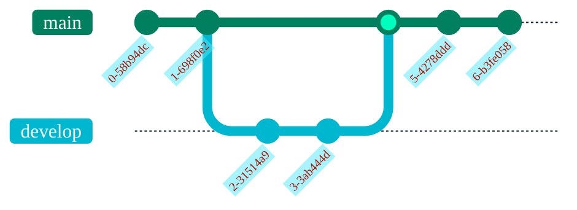

::date::
xx.yy.2024

::title::
# Ciklum slides template

::description::
<div class="pb-6">Everything you need to know about, ....</div>
<div>Your Name</div>
<div>Developer at Ciklum</div>

---
layout: default
---

- There are the following layouts prepared for Ciklum presentations:
  - centered
  - default (same as if you don't define any)
  - iframe
  - image-bottom-right
  - image-right (top right)
  - intro (section for name and date included)
  - thank you
  - two columns (can have also full-width section above `::top::` and below `::bottom::` the columns)
- Any custom Ciklum slide can have a background
  - If you want to add our own background image use it as `background: ./test.png` and add the image into the `public` root folder

---
layout: centered
background: ./theme/bgs/wawy3.png
---

# Section title

---
layout: centered
background: ./theme/bgs/wawy2.png
---

# Section title

## With subtitle

And some text about something

---
layout: image-right
image: test.png
---

# Image right

asdasd asd sdf sdafgf sdf sdf sdf sdf asdasd asd sdf sdafgf sdf sdf sdf sdf asdasd asd sdf sdafgf sdf sdf sdf sdf asdasd asd sdf sdafgf sdf sdf sdf sdf asdasd asd sdf sdafgf sdf sdf sdf sdf asdasd asd sdf sdafgf sdf sdf sdf sdf <a href="https://github.com/">Link</a>

---
layout: image-bottom-right
image: test.png
---

# Image bottom right

asdasd asd sdf sdafgf sdf sdf sdf sdf asdasd asd sdf sdafgf sdf sdf sdf sdf asdasd asd sdf sdafgf sdf sdf sdf sdf asdasd asd sdf sdafgf sdf sdf sdf sdf asdasd asd sdf sdafgf sdf sdf sdf sdf asdasd asd sdf sdafgf sdf sdf sdf sdf

---

# Default slide 

## You don't need to specify a layout here


* &lt;funny meme goes here&gt;
* &lt;funny meme goes here&gt;
* &lt;funny meme goes here&gt;
* &lt;funny meme goes here&gt;

---
layout: two-columns
---

::top::
# Two columns layout

::left::
All content after `::left::` ends up on the left

Code here

```ts
<div *ngIf="number === 0; else checkNumbers">
  Cannot divide by {{ number }}
</div>

<ng-template #checkNumbers>
  <div *ngIf="isOdd(number); else isEven">
    Divisor {{ number }} is odd
  </div>
</ng-template>

<ng-template #isEven>
  <div>
  Divisor {{ number }} is even
  </div>
</ng-template>
```

::right::
All content after `::right::` ends up on the left

- Some other content here
- Some other content here
- Some other content here
- Some other content here

---
layout: centered
background: '#f3f3f3'
---

<div class="mb-3">Standalone Image</div>


---
layout: centered
background: '#f3f3f3'
transition: slide-up
---

# Next slide is an iframe

---
layout: iframe
url: https://sli.dev/builtin/layouts
---

---
layout: two-columns
---

::left::
# Table of contents

You can use the `Toc` component to generate a table of contents for your slides:

```html
<Toc minDepth="1" maxDepth="1"></Toc>
```

The title will be inferred from your slide content, or you can override it with `title` and `level` in your frontmatter.

::right::

<Toc v-click minDepth="1" maxDepth="2"></Toc>

---

# Code

Use code snippets and get the highlighting directly, and even types hover![^1]

```ts {all|5|7|7-8|10|all} twoslash
// TwoSlash enables TypeScript hover information
// and errors in markdown code blocks
// More at https://shiki.style/packages/twoslash

import { computed, ref } from 'vue'

const count = ref(0)
const doubled = computed(() => count.value * 2)
doubled.value = 2
```

<arrow v-click="[4, 5]" x1="350" y1="310" x2="195" y2="334" color="var(--ciklum-color-blue)" width="2" arrowSize="1" />

<!-- This allow you to embed external code blocks -->
<<< @/snippets/external.ts#snippet

<!-- Footer -->
[^1]: [Learn More](https://sli.dev/guide/syntax.html#line-highlighting)

<!-- Inline style -->
<style>

.footnotes {
  @apply text-sm;
}
.footnote-backref {
  display: none;
}
</style>

<!--
Notes can also sync with clicks

[click] This will be highlighted after the first click

[click] Highlighted with `count = ref(0)`

[click:3] Last click (skip two clicks)
-->

---
level: 2
---

# Shiki Magic Move

Powered by [shiki-magic-move](https://shiki-magic-move.netlify.app/), Slidev supports animations across multiple code snippets.

Add multiple code blocks and wrap them with <code>````md magic-move</code> (four backticks) to enable the magic move. For example:

````md magic-move
```ts {*|2|*}
// step 1
const author = reactive({
  name: 'John Doe',
  books: [
    'Vue 2 - Advanced Guide',
    'Vue 3 - Basic Guide',
    'Vue 4 - The Mystery'
  ]
})
```

```ts {*|1-2|3-4|3-4,8}
// step 2
export default {
  data() {
    return {
      author: {
        name: 'John Doe',
        books: [
          'Vue 2 - Advanced Guide',
          'Vue 3 - Basic Guide',
          'Vue 4 - The Mystery'
        ]
      }
    }
  }
}
```

```ts
// step 3
export default {
  data: () => ({
    author: {
      name: 'John Doe',
      books: [
        'Vue 2 - Advanced Guide',
        'Vue 3 - Basic Guide',
        'Vue 4 - The Mystery'
      ]
    }
  })
}
```

Non-code blocks are ignored.

```vue
<!-- step 4 -->
<script setup>
const author = {
  name: 'John Doe',
  books: [
    'Vue 2 - Advanced Guide',
    'Vue 3 - Basic Guide',
    'Vue 4 - The Mystery'
  ]
}
</script>
```
````

---

# Diagrams

You can create diagrams / graphs from textual descriptions, directly in your Markdown.

<div class="grid grid-cols-3 gap-5 pt-4 -mb-6">


</div>

[Learn More](https://sli.dev/guide/syntax.html#diagrams)

---

# Diagrams 2

You can create diagrams / graphs from textual descriptions, directly in your Markdown.

<div class="grid grid-cols-2 gap-5 pt-4 -mb-6">




</div>

[Learn More](https://sli.dev/guide/syntax.html#diagrams)

---
withLogo: false
background: '#f3f3f3'
---

<excalidraw-svg src="drawings/example.excalidraw" :fullscreen="true" />

---

# Clicks Animations

You can add `v-click` to elements to add a click animation.

<div v-click>

This shows up when you click the slide:

```html
<div v-click>This shows up when you click the slide.</div>
```

</div>

<br>

<v-click>

The <span v-mark.red="3"><code>v-mark</code> directive</span>
also allows you to add
<span v-mark.circle.orange="4">inline marks</span>
, powered by [Rough Notation](https://roughnotation.com/):

```html
<span v-mark.underline.orange>inline markers</span>
```

</v-click>

<div mt-20 v-click>

[Learn More](https://sli.dev/guide/animations#click-animations)

</div>

---

# Monaco Editor

Add `{monaco}` to the code block to turn it into an editor:

```ts {monaco}
import { ref } from 'vue'
import hello from './external'

const code = ref('const a = 1')
hello()
```

Use `{monaco-run}` to create an editor that can execute the code directly in the slide:

```ts {monaco-run}
function fibonacci(n: number): number {
  return n <= 1
    ? n
    : fibonacci(n - 1) + fibonacci(n - 2) // you know, this is NOT the best way to do it :P
}

console.log(Array.from({ length: 10 }, (_, i) => fibonacci(i + 1)))
```

---
layout: centered
---

# Questions?

---
layout: thank-you
---
